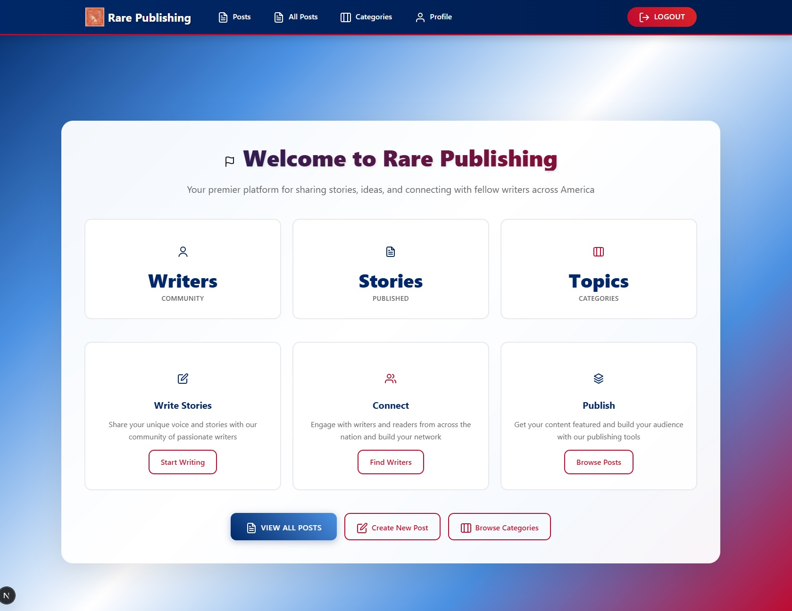

## RARE Client

RARE Publishing client side application

# Overview

Rare client is the front end application for Rare publishing. Users can create, edit, and delete text posts with images and also add comments. All posts are user specific and can be categorized and filtered by category.

# User Story

The ideal user for Rare is someone who wants to share text posts with images with their peers and categorize them for easy access.

# Features

- Users can create, edit, and delete simple text posts in a category and add an image via url, with a title and text field content, and a publication date.
- Users can also create, edit, and delete categories.
- Users can view posts and comments made by other users but cannot edit or delete posts made by other users

# Screenshots

# Links

- [Wireframe](https://miro.com/app/board/o9J_kiGCSK4=/)
- [ERD](https://dbdiagram.io/d/638e7896bae3ed7c4544e8ab)
- [Project Board](https://github.com/users/mikemcgee92/projects/6)
- [Server API](https://github.com/Tyler-Davenport/rare-server)

# Contributors

[Mike McGee](https://github.com/mikemcgee92), [Tyler Davenport](https://github.com/Tyler-Davenport), [Ozzy Akben](https://github.com/omerakben)
